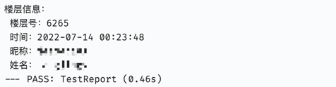

## 同事吧楼层信息查询
> 场景：一个贴楼层数量过多，一页一页翻面太累啦，直接使用脚本可获取对应楼层的数据

- 功能说明：查询指定楼层的楼层信息，目前可查看目标楼层的页数、盖楼时间、昵称、姓名、内容


- 如何使用：
```go
    func example() {
        floor.New("./config.example.yml").Report()
    }
```


- 结果展示：

    
